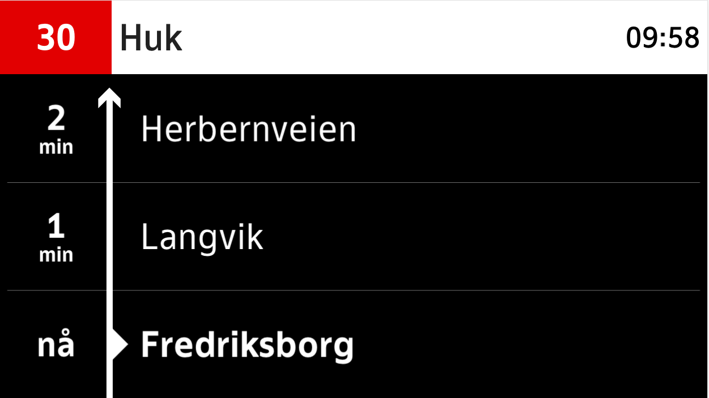
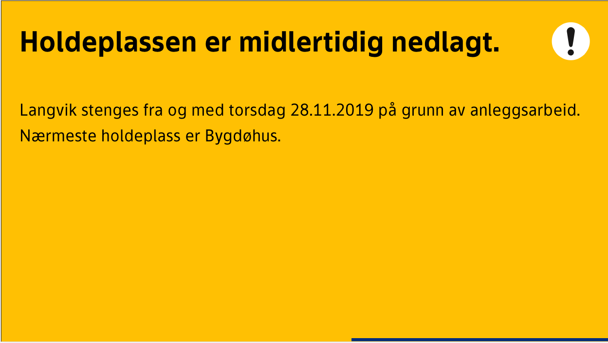

# DPI Bus Monitor Screen Configuration

DPI Bus-monitor supports a range of pre-defined display types depending on size of the screen, screen location and functional needs.
These screens are accessible directly through URL with following schema: `{BaseURL}/#display/{type}`, eg. `http://localhost/#display/1`.

## Overview of screen types

| Id | Content | Aspect ratio | Optimal screen resolution (width x height) |
|----|---------|--------------|--------------------------------------------| 
| 1  | Journey, Media | 32:9 | 1920x540 | 
| 2 | Horizontal journey | 48:9 | 1920x360 |
| 3 | Journey | 16:9  | 1920x1080, 960x540 | 
| 4 | Journey / Media | 16:9 |  1920x1080, 960x540 |

### Screen config 1

Running state of config 1, displaying journey (60% of the width) and next hubs (fallback, when no media, deviations or announcements are showing).

This is the only configuration used for 32:9, and *all* 32:9 screens must be configured to use this configuration.

Config 1 showing an example deviation. 

### Screen config 2

Running state of config 2. 
This is the only configuration used for 48:9, and *all* 48:9 screens must be configured to use this configuration.

### Screen config 3

Running state of config 3. 
Intended for screens dedicated to showing journey, i.e. media content (campaign, video) and deviations / announcements will be ignored.

### Screen config 4

Running state of config 4. 
Default state for config 4 is showing journey.

Showing announcement.
Media and deviations / announcements will -- when active -- replace journey. 

## Assignment of screen config id for screens
General rule of thumb for assignment of configuration id: 

1. All 32:9 (1920x540) screens should always be assigned config 1
2. All 48:9 (1920x360) screen should always be assigned config 2
3. All 16:9 (1920x1080 or 960x540) should always be assigned config 3, if any of these conditions are met:
  1. This is the only screen on board
  2. This screen is in front of the bus
4. Screen config 4 is used for the *right* screen when 2x 16:9 screens are horizontally aligned, facing the same way (cf. example 1). (For all other 16:9 screens, use config 3)

Example 1

